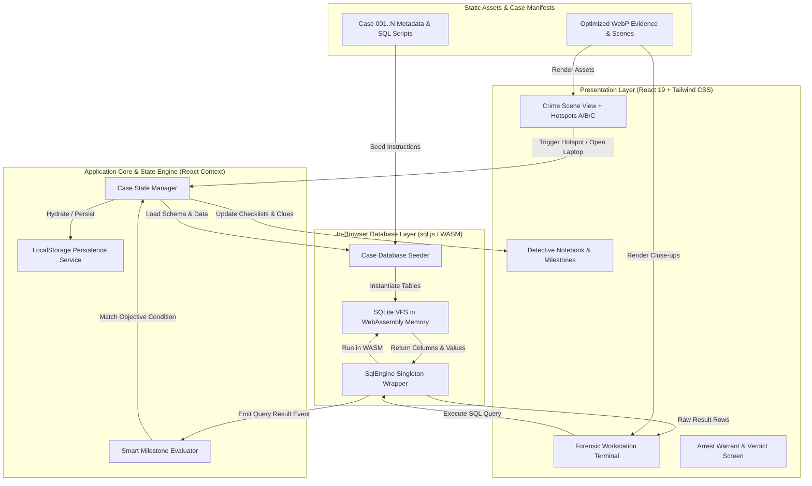
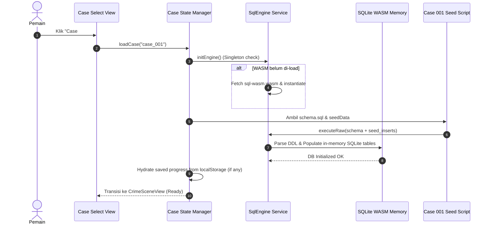
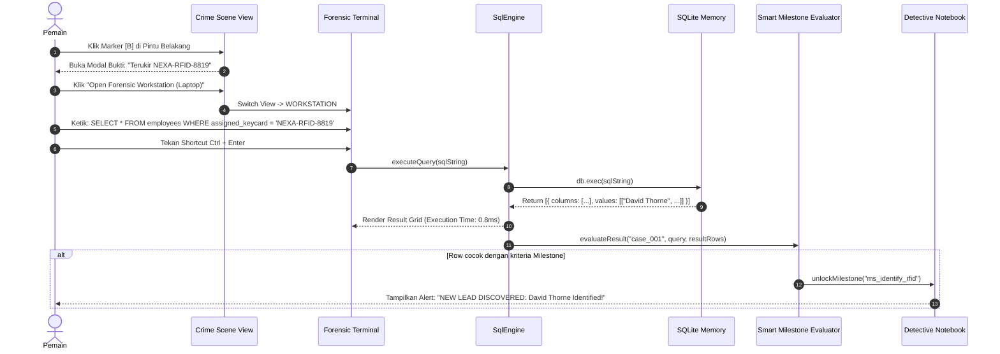

# Technical Architecture Document (ARCHITECTURE.md)
# Project: SQL Case Detective (Cyber Forensics Edition)

**Document Version:** 1.0.0  
**Status:** Approved Architecture  
**Core Pattern:** 100% Client-Side In-Browser Database Engine (Zero-Backend SPA)  

---

## 1. System Overview & Architectural Principles

Aplikasi ini dirancang menggunakan arsitektur **Zero-Backend Single Page Application (SPA)**. Berbeda dengan platform SQL konvensional yang mengirim query ke server database di cloud (seperti PostgreSQL/Supabase), seluruh eksekusi database dilakukan **100% di memori browser pemain menggunakan SQLite WebAssembly (`sql.js`)**.

### Keunggulan Arsitektur Ini:
1. **Zero Latency (0ms Network Roundtrip):** Query dieksekusi secara instan di CPU lokal pengguna (< 2 milidetik).
2. **Zero Server Cost & Maintenance:** Tidak membutuhkan server backend, VPS, atau sewa database cloud. Hosting dapat dilakukan secara gratis di GitHub Pages, Vercel, atau Cloudflare Pages.
3. **Imunitas Penuh terhadap SQL Injection:** Karena database berjalan di dalam sandbox WebAssembly memori browser pemain, serangan `DROP TABLE` atau `DELETE FROM` hanya mempengaruhi sesi lokal pemain dan dapat di-reset dalam 1 klik.
4. **Offline Capability:** Sekali aset di-cache oleh browser, game dapat dimainkan tanpa koneksi internet sama sekali.

---

## 2. High-Level System Architecture Diagram



---

## 3. Data Flow & Lifecycle Diagrams

### 3.1 Case Initialization Flow (Pemuatan Kasus)
Ketika pemain memilih suatu kasus di antarmuka Stage Selection:



---

### 3.2 The "Two-Way Clue Loop" Execution Flow
Alur eksekusi saat pemain menghubungkan bukti visual dengan query SQL:



---

## 4. Subsystem & Component Specifications

### 4.1 SqlEngine Service (`src/services/sqlEngine.ts`)
Komponen singleton yang bertindak sebagai jembatan (*bridge*) antara kode TypeScript dengan runtime WebAssembly SQLite:

```typescript
export interface QueryExecutionResult {
  columns: string[];
  values: unknown[][];
  executionTimeMs: number;
  rowCount: number;
  error?: string;
}

export class SqlEngineService {
  private static instance: SqlEngineService;
  private db: Database | null = null;
  private isInitializing = false;

  public static getInstance(): SqlEngineService;
  public async init(): Promise<void>;
  public executeQuery(sql: string): QueryExecutionResult;
  public getTableList(): { name: string; columns: { name: string; type: string }[] }[];
  public resetDatabase(schemaSql: string, seedSql: string): void;
}
```

### 4.2 Case State Manager (`src/context/CaseContext.tsx`)
Mengelola seluruh state game secara reaktif tanpa library pihak ketiga yang rumit:
- **`activeView`**: State transisi layar (`'STAGE_SELECT' | 'CRIME_SCENE' | 'WORKSTATION' | 'VERDICT'`).
- **`unlockedEvidence`**: Daftar ID bukti yang sudah diinspeksi atau dibuka pemain.
- **`completedMilestones`**: Daftar ID checklist yang telah terpenuhi melalui query pemain.
- **`queryHistory`**: Riwayat query yang pernah dijalankan pemain untuk navigasi tombol *Up/Down Arrow*.
- **`notebookNotes`**: Catatan teks bebas pemain yang disinkronkan ke `localStorage`.

### 4.3 Smart Milestone Evaluator (`src/services/milestoneEvaluator.ts`)
Sistem evaluasi berbasis aturan (*rule-based condition matcher*) untuk menentukan apakah query pemain telah membuka sebuah fakta baru.
- **Kondisi Evaluasi:**
  - `COLUMN_VALUE_MATCH`: Memeriksa apakah salah satu baris hasil query mengandung kolom tertentu dengan nilai spesifik (contoh: kolom `assigned_keycard = 'NEXA-RFID-8819'`).
  - `ROW_COUNT_THRESHOLD`: Memeriksa apakah pemain berhasil memfilter data ke jumlah baris yang akurat.
- Sistem ini **tidak memeriksa string query secara kaku**, melainkan memeriksa **data hasil yang didapatkan pemain**. Sehingga pemain bebas menggunakan variasi query apa pun (`JOIN`, `WHERE`, `IN`, `LIKE`) asalkan mendapatkan kebenaran faktanya.

---

## 5. Security, Isolation & Performance Profile

### 5.1 Keamanan & Isolasi
* **Tanpa Server-Side Risk:** Tidak ada API endpoint yang bisa dibobol atau di-DDoS.
* **Sandbox Browser:** SQLite WASM berjalan murni di sandbox Web Worker / JS runtime tab browser pemain.
* **Crash Proof:** Jika pemain menjalankan query infinite loop atau syntax ngawur, error di-catch secara elegan oleh wrapper `try-catch` dan disajikan sebagai pesan terminal ramah pengguna tanpa membuat browser *freeze*.

### 5.2 Profil Memori & Performa
* **Ukuran Bundle:**
  - `sql-wasm.wasm`: ~1.2 MB (di-load sekali dan di-cache selamanya via HTTP cache).
  - Runtime JavaScript: < 200 KB gzipped.
* **Konsumsi RAM Browser:**
  - Database in-memory SQLite per kasus hanya memakan ~50 KB - 100 KB memori (sangat ringan bahkan untuk smartphone kelas menengah).
* **Performa Rendering:**
  - Result Data Grid menggunakan sistem pagination (default 20 baris per halaman) untuk mencegah lag DOM ketika pemain menjalankan `SELECT *` pada tabel berukuran ratusan baris.

---

## 6. Extensibility: Cara Menambahkan Kasus Baru

Arsitektur dibuat **Modular & Pluggable**. Untuk menambahkan Kasus 2 (*The Neon Gallery Heist*) atau Kasus 3 di masa depan, developer **tidak perlu mengubah engine utama**, cukup membuat folder baru di `src/cases/`:

```
src/cases/case02/
├── metadata.ts       # Judul, narasi, foto TKP, koordinat marker [A], [B], [C]
├── schema.sql        # DDL tabel SQLite kasus 2
├── seedData.ts       # Data pengisian tabel & alibi tersangka
└── milestones.ts     # Aturan kondisi pembukaan petunjuk
```

Kemudian daftarkan ID kasus baru tersebut ke dalam `src/cases/index.ts`. Engine secara otomatis merender kasus baru di Stage Selection.

---

Dokumen ini mendefinisikan arsitektur teknis lengkap untuk pembangunan dan skalabilitas sistem.
