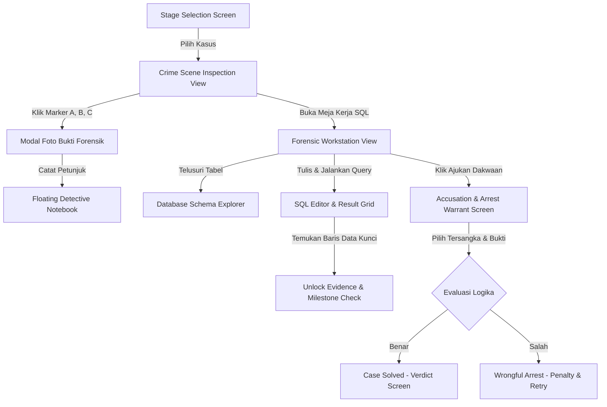

# Product Requirements Document (PRD)
# Project: SQL Case Detective (Educational Puzzle & Investigation Edition)

**Document Version:** 2.0.0  
**Status:** Implemented & Verified  
**Theme:** Light Neutral & Modern Educational Puzzle (Anti-Slop Modern UI)  
**Standard:** /design-taste-frontend (VARIANCE: 6, MOTION: 4, DENSITY: 5)  
**Architecture Principle:** Ponytail Minimalist (100% Client-Side SQLite WASM, Zero-Backend Overhead)  

---

## 1. Executive Summary & Vision

### 1.1 Product Vision
**SQL Case Detective** adalah web application game investigasi kriminal interaktif yang menggabungkan penyelidikan visual (foto tempat kejadian perkara, inspeksi bukti fisik, rekaman CCTV) dengan kekuatan analisis **SQL (Structured Query Language)**.

Game ini mengimplementasikan konsep **"The Two-Way Clue Loop"**:
1. **Visual ke SQL:** Pemain menginspeksi foto TKP untuk mengidentifikasi petunjuk fisik (misal: kartu RFID retak, cangkir kopi beracun, log server).
2. **SQL ke Visual:** Hasil query database SQLite di browser mengungkap fakta baru yang membuka dokumen rahasia, rekaman CCTV tangga darurat, dan identitas tersangka.

### 1.2 Core Differentiation vs SQLNoir

| Fitur | SQLNoir (Existing Reference) | SQL Case Detective (Our Game) |
| :--- | :--- | :--- |
| **Media Investigasi** | 100% Teks & Tabel statis | Foto TKP Interaktif + Foto Bukti Close-up + Mugshot Profil |
| **Penyelidikan TKP** | Membaca paragraf narasi | Hotspot Marker Pin `[A]`, `[B]`, `[C]` dengan animasi taktil halus |
| **Eksekusi SQL** | Cloud API (Supabase Backend) | **In-Browser SQLite WASM (`sql.js`)** (0ms latency, offline, privacy terjaga) |
| **Penyelesaian Clue** | Mengetik jawaban teks ke form | **Smart Milestone Unlock** (Otomatis mendeteksi baris data hasil query) |
| **Gaya Desain Frontend** | Classic Noir Terminal | **Anti-Slop Light Neutral** (Notion / Linear style, tipografi Nunito) |

---

## 2. Core User Journey & Interaction Flow



---

## 3. Detailed Feature Specifications (Frontend & UX)

### 3.1 Screen 1: Stage Selection (Papan Berkas Kasus)
- **Tampilan Antarmuka:** Bersih (*light surface*), ramah, dan berorientasi edukasi pemecahan masalah.
- **Asymmetric Split Hero:**
  - *Sisi Kiri:* Judul utama, value proposition ringkas (maksimal 20 kata), dan tombol aksi langsung *"Mulai Kasus 001"*.
  - *Sisi Kanan:* Kartu alur investigasi interaktif 3 tahap (Inspeksi Foto TKP, Uji Query SQL, Ajukan Dakwaan).
- **Komponen Kartu Kasus (Clean Cards):**
  - Thumbnail foto kasus bersih tanpa badge atau tag yang melayang di atas gambar.
  - Tag nomor berkas (`caseNumber`), tingkat kesulitan, status ketersediaan, lokasi, dan tanggal diletakkan teratur di area teks bawah gambar.
  - Tombol aksi jelas (*"Masuk ke TKP"* atau *"Berkas Terkunci"*).

---

### 3.2 Screen 2: Interactive Crime Scene (Inspeksi Foto TKP)
- **Visual Utama:** Foto sudut pandang TKP resolusi tinggi di dalam bingkai deep slate (`#0f172a`) berujung lengkung halus dengan pencahayaan natural.
- **Marker Pin Taktil (`[A]`, `[B]`, `[C]`):**
  - Pin bulat kuning amber dengan border putih dan animasi *subtle bounce* (tanpa efek radar glow neon).
  - *Saat Diklik:* Membuka modal inspeksi barang bukti.
- **Header Navigasi Cepat:**
  - Tombol kembali ke Papan Kasus.
  - Tombol Catatan Kasus (*Hotkey: N*).
  - Tombol utama: *"Meja Kerja SQL"* (Ikon Terminal).
  - Tombol sekunder: *"Ajukan Dakwaan"*.
- **Briefing Bawah:** Ringkasan laporan awal insiden dengan waktu kejadian dan tombol akses instan ke Meja Kerja SQL.

---

### 3.3 Screen 3: Forensic Workstation (Meja Kerja SQL)
Dirancang dengan kenyamanan dan ergonomi *developer tool* modern (seperti TablePlus dan Supabase Studio):

1. **Left Sidebar - Database Schema Explorer:**
   - Menampilkan seluruh tabel aktif dengan fitur pencarian instan.
   - Pohon kolom (*tree view*) yang menunjukkan nama kolom, tipe data, dan ikon Primary Key.
   - Tombol salin query cepat: `SELECT * FROM table LIMIT 25;`.
   - Fitur klik nama kolom untuk menyisipkannya langsung ke editor SQL.
2. **Center Area - SQL Code Editor & Result Grid:**
   - Editor monospace bersih dengan font `Fira Code` dan kontras teks tinggi.
   - Tombol template query instan berbentuk pill minimalis (`employees`, `keycard_scans`, `cctv_logs`, `phone_records`).
   - Tombol jalankan query dengan shortcut `Ctrl + Enter` (atau `Cmd + Enter`).
   - Penampil tabel hasil (*QueryResultGrid*) dengan sticky header netral, zebra-striping lembut, indikator waktu eksekusi (ms), paginasi 15 baris, dan tombol sematkan bukti (*Pin to Notes*).
   - Banner kesalahan SQL berwarna merah lembut jika terjadi kesalahan sintaks.
3. **Right Panel - Quick Evidence Dock:**
   - Panel samping berisi progres objektif kasus dan daftar barang bukti yang telah terbuka beserta thumbnail.

---

### 3.4 Screen 4: Floating Detective Notebook (Buku Catatan)
- Drawer geser (*slide-over*) yang muncul dari sisi kanan layar (bisa di-toggle via Hotkey `N` atau tombol header).
- **Tab 1: Petunjuk Kasus (Milestones):**
  - Checklist objektif penyelidikan yang otomatis tercentang saat query SQL pemain menghasilkan baris bukti target.
  - Kartu milestone dengan border hijau sukses saat selesai atau tombol *"Buka Meja Kerja SQL"* jika belum terselesaikan.
- **Tab 2: Catatan Bebas (Scratchpad):**
  - Textarea nyaman untuk mencatat alibi, hipotesis, dan query penting.
  - Otomatis tersimpan ke `localStorage` browser pemain.

---

### 3.5 Screen 5: Evidence Inspection Modal (Zoom Bukti Fisik)
- Dialog modal putih bersih dengan bayangan lembut (`--shadow-modal`).
- Menampilkan foto makro barang bukti close-up tanpa teks overlay.
- Tag kategori dan lokasi penemuan.
- Deskripsi detail dan catatan analisis forensik lapangan.
- Box rekomendasi query SQL dengan tombol langsung untuk membukanya di Meja Kerja SQL.

---

### 3.6 Screen 6: Accusation & Arrest Warrant (Pengajuan Dakwaan)
- Modal pengajuan perintah penangkapan resmi:
  1. **Tunjuk Tersangka Utama:** Grid profil foto dan jabatan para tersangka, ditandai border aksen indigo yang tegas saat dipilih.
  2. **Lampirkan Bukti Kunci:** Checklist barang bukti pendukung yang telah terbuka lewat query SQL.
  3. **Catatan Reka Ulang Kronologi:** Area teks ringkasan kronologi kejadian.
- **Layar Hasil (Verdict Screen):**
  - Jika pilihan tepat: Layar sukses ramah (*"Kasus Berhasil Dipecahkan!"*) lengkap dengan cerita kronologi kejahatan, profil pelaku, dan tombol mainkan ulang.
  - Jika salah: Penjelasan logis mengapa bukti belum mencukupi (*"Analisis Bukti Belum Tepat"*) beserta tombol kembali ke meja kerja.

---

## 4. Kasus Perdana (Case #001): "The Midnight Penthouse Breach"

### 4.1 Narasi Kasus
* **Korban:** Ronald Sterling (CEO NexaCore Tech, 48 tahun).
* **Waktu Kematian:** 14 September 2026, antara pukul 23:30 - 00:30 WIB.
* **TKP:** Penthouse lantai 42 NexaCore Tower, Jakarta.
* **Insiden:** Korban ditemukan tewas di meja kerjanya dengan cangkir espresso beracun sianida. Private server vault di samping meja terbuka dan flash drive master encryption key raib.

### 4.2 Bukti Fisik di Foto TKP (Hotspots)
* **Marker `[A]` (Meja Kerja Korban):**
  - Cangkir espresso dengan pesanan kafe berstempel nama korban.
* **Marker `[B]` (Pintu Belakang Penthouse):**
  - Kartu akses pegawai retak berlabel fisik `"NEXA-RFID-8819"`.
* **Marker `[C]` (Layar Server Vault):**
  - Monitor server mencatat ekstraksi USB tidak sah pada pukul 23:52:10.

### 4.3 Alur Investigasi & Kunci Pemecahan
1. **Query 1:** Cari siapa pemilik kartu `NEXA-RFID-8819` yang tertinggal di TKP.
   ```sql
   SELECT * FROM employees WHERE assigned_keycard = 'NEXA-RFID-8819';
   ```
   *(Hasil: Kartu terdaftar atas nama David Thorne - VP of Security).*
2. **Query 2:** Periksa riwayat keycard David Thorne di jam kejadian (23:00 - 00:30).
   ```sql
   SELECT * FROM keycard_scans 
   WHERE keycard_id = 'NEXA-RFID-8819' 
     AND timestamp BETWEEN '2026-09-14 23:00:00' AND '2026-09-15 00:30:00';
   ```
   *(Hasil: Pintu darurat penthouse di-scan pukul 23:48).*
3. **Query 3:** Cek alibi David Thorne di rekaman CCTV.
   ```sql
   SELECT * FROM cctv_logs 
   WHERE timestamp BETWEEN '2026-09-14 23:40:00' AND '2026-09-15 00:10:00'
     AND location LIKE '%Penthouse%';
   ```
   *(Hasil: CCTV merekam seseorang berjaket keamanan keluar membawa ransel pukul 23:55).*
4. **Query 4:** Cek motif keuangan di `phone_records`.
   ```sql
   SELECT * FROM phone_records WHERE sender_name = 'David Thorne' OR receiver_name = 'David Thorne';
   ```
   *(Hasil: Ditemukan chat mencurigakan tentang pembayaran kripto senilai 500,000 USDT setelah data vault diserahkan).*

---

## 5. Arsitektur Teknis Frontend & Design System

### 5.1 Technology Stack
* **Bundler & Framework:** Vite + React 19 + TypeScript.
* **In-Browser Database:** `sql.js` (SQLite dikompilasi ke WebAssembly), berjalan 100% di browser pemain tanpa server backend.
* **Styling:** Co-located Modular CSS (12 file komponen) berstandar `/design-taste-frontend`.
* **Tipografi:** Google Fonts `Nunito` (Display), `Nunito Sans` (Body), dan `Fira Code` (Monospace).
* **Icons:** `lucide-react` dengan proporsi dan warna terkalibrasi.
* **State Management:** React Context API terpusat (`CaseContext.tsx`) + `localStorage` persistence tanpa library pihak ketiga.

### 5.2 Design Tokens (`src/index.css`)
* `--bg-primary`: `#ffffff` (Latar putih bersih)
* `--bg-secondary`: `#f8fafc` (Slate sangat lembut)
* `--bg-tertiary`: `#f1f5f9` (Header tabel & hover baris)
* `--bg-dark-container`: `#0f172a` (Frame kanvas TKP)
* `--accent`: `#4f46e5` (Aksen indigo modern)
* `--accent-light`: `#eef2ff`
* `--accent-hover`: `#4338ca`
* `--text-primary`: `#0f172a`
* `--text-secondary`: `#475569`
* `--text-muted`: `#94a3b8`
* `--border-subtle`: `#e2e8f0`
* `--border-strong`: `#cbd5e1`
* `--radius-sm`: `6px`, `--radius-md`: `10px`, `--radius-lg`: `14px`

---

## 6. Implementation & Refactoring History

1. **Sprint 1 - Foundation & SQLite Engine:**
   - Inisialisasi Vite + React 19 + TypeScript.
   - Singleton engine SQLite WASM (`sqlEngine.ts`) dan tes mandiri (`npm test`).
2. **Sprint 2 - Interactive Crime Scene & Evidence:**
   - Kanvas foto TKP penthouse dan pin interaktif `[A]`, `[B]`, `[C]`.
   - Modal inspeksi barang bukti (`EvidenceModal.tsx`).
3. **Sprint 3 - Forensic Workstation & SQL Editor:**
   - Schema explorer interaktif, SQL Editor, dan tabel hasil terpaginasi.
4. **Sprint 4 - Notebook & Milestone System:**
   - Slide-over notebook drawer (Hotkey: N) dan toast alert petunjuk terbuka.
5. **Sprint 5 - Accusation & Verdict Engine:**
   - Modal surat penangkapan dan layar resolusi vonis kasus.
6. **Sprint 6 - Anti-Slop Frontend Refactoring (/design-taste-frontend):**
   - Transisi total dari dark cyber noir ke light neutral & educational puzzle.
   - Penerapan Tiga Dial (`VARIANCE: 6`, `MOTION: 4`, `DENSITY: 5`).
   - Migrasi 150+ inline style objects ke 12 file CSS terpisah (*co-located*).
   - Pembersihan seluruh AI tells: zero em-dashes, tanpa badge melayang di atas foto, tanpa label langkah generik, dan tanpa pure black `#000000`.
